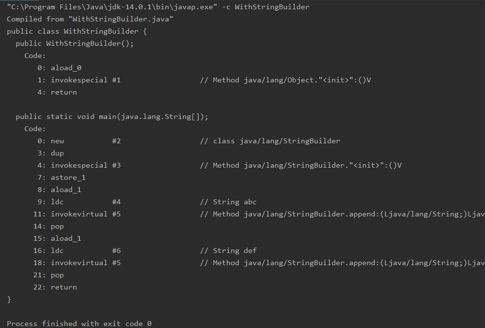
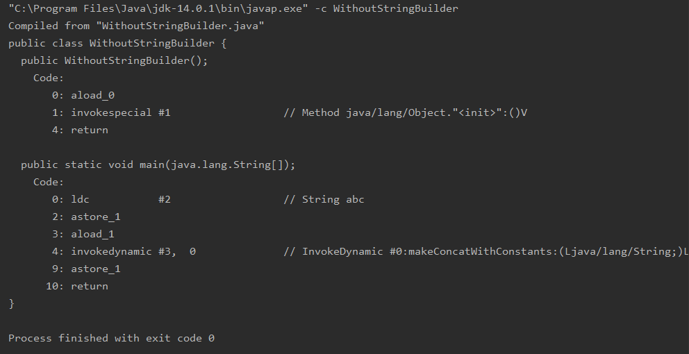

# Sprawozdanie APRO Laboratorium 5 
### Antoni Kwietniewski(303706)
## Zadanie 1
W celu wykonania zadania napisałem dwa programy konkatenujące łańcuchy znaków na różne sposoby.
Pierwszy z nich używa operatora `+=` .
```java 
public class WithoutStringBuilder {
    
    public static void main(String[] args) {
        
        String word = "abc";
        word+="def";
        
    }

}
```
Natomiast drugi z nich stosuje metodę konkatenowania poprzez użycie obiektu klasy `StringBuider`.
```java 
public class WithStringBuilder {

    public static void main(String[] args) {

        StringBuilder stb = new StringBuilder();
        stb.append("abc");
        stb.append("def");

    }
}
```
W celu przeanalizowania działania obu algorytmów posłużyłem się programem `javap`, który umożliwia deasemblację plików .class.  
Wynik dla algorytmu w którym implementowałem `StringBuilder`:   

  ### Instrukcje 1  
`aload_0` - pobiera referencję do obiektu ze zmiennej lokalnej i umieszcza ją na stosie.  
`invokespecial #1` - wywołuje instrukcję konstruktora.  
`return` - kończy instrukcję konstruktora i informmuje o zakńczeniu jego wykonywania.  
Później wykonywane są instrukcje zapisane w metodzie main:   
`new` - tworzy referencję do obiektu klasy StringBuilder.   
`dup` - duplikuje referencje powstałą w poprzednim kroku. Na stosie znajdują się teraz dwie identyczne referencje.   
`invokespecial #3` - wywołuje konstruktor z klasy StringBuilder i zdejmuje ze stosu jedną, zduplikowaną wcześniej referencję.  
`astore_1` - zdejmuje referencję ze stosu i przypisuje ją do zmiennej lokalnej word.    
`aload_1` - pobiera referencję ze zmiennej lokalnej word i wrzuca ją na czubek stosu.  
`ldc` - wrzuca na stos referencję do stringa word.  
`invokevirtual #5`  - wywołuje metodę append z klasy StringBuilder i wrzuca na górę stosu referencję do utworzonego obiektu.  
W tym momencie w pamięci znajdują się 2 referencje do tej samej komórki następuje operacja `pop`.
Ten sposób konkatenacji dokonuje zmian na referencji i nie tworzy nowej referencji w pamięci.(Nie musiała angażować większej ilości zasobów.)
Później następuje ponowne pobranie referencji ze zmiennej lokalnej na stos, umieszczenie na stosie stringa("def"), wykonanie metody append oraz usunięcie ze stosu referencji.  
`return` informuje o zakończeniu się tej metody  


Wynik dla algorytmyu, który konkatenował wartości z użyciem operatora `+=`:  


  ### Instrukcje 2
`aload_0` - pobiera referencję do obiektu ze zmiennej lokalnej i umieszcza ją na stosie.  
`invokespecial #1` - wywołuje instrukcję konstruktora.  
`return` - kończy instrukcję konstruktora i informmuje o zakńczeniu jego wykonywania.  
Później wykonywane są instrukcje zapisane w metodzie main:   
`ldc` - wrzuca na stos referencję do stringa stb.  
`astore_1` - zdejmuje referencję ze stosu i przypisuje ją do zmiennej lokalnej stb. 
`aload_1` - pobiera referencję ze zmiennej lokalnej stb i wrzuca ją na czubek stosu.  
`invokedynamic #3,  0` - wywołanie metody knkatenacji łańcucha znaków- tworzy to nową referencję    
`astore_1` - zdejmuje referencję ze stosu i przypisuje ją do zmiennej lokalnej stb.  
`return` - informuje o zakończeniu się tej metody.  

### Wnioski 
Jeżeli zależy nam na jak najlepszej efektywności algorytmu powinniśmy wybrać metodę konkatenacji polegającą na utworzeniu obiektu klasy StringBuilder, zastosowanie tej metody pozwoli zaoszczędzić zasoby pamięci. Ta metoda nie towrzy nowej referencji, nowego obiektu. Wszystkie operacje są wykonywane na jednym obiekcie zapisanym tylko w jednym miejscu w pamięci. Kiedy chcemy użyć operatorów `+=` tworzona jest kolejna referencja do nowego obiektu, a co za tym idzie, przez pewien czas w naszej pamięci znajdują się dwie referencje. Nie jest to potrzebne, ponieważ później jedna zostanie nadpisana przez drugą.  
  
## Zadanie 2
W celu wykonania zadania zdekompilowałem otrzymane pliki w środowisku IntelliJ. Aby odszyfrować hsło przeanalizowałem kod dwóch klas programu. Dodałem również komentarze w miejscach, które mogą być niejasne.  
Klasa Coder:  
```java
public class Coder {
    public Coder() {
    }

    static String code(String var0) {
            StringBuilder var1 = new StringBuilder();
//var2.length() - długość 7
//var0 = 0tWso47
            for(int var2 = 0; var2 < var0.length(); ++var2) {
//przesuwanie w tablicy ASCII o 5 indeksów w górę i konkatenacja
                var1.append((char)(var0.charAt(var2) + 5));
            }
//var1 = 5y\xt9<
        return var1.toString();
    }
}
```
Klasa Main:  
```java 

import java.text.SimpleDateFormat;
import java.time.Instant;
import java.util.Date;

public class Main {
    public Main() {
    }

    public static void main(String[] var0) {
        if (var0.length != 1) {//var0[] - musi być tablicą jednoelementową
            System.out.println("Wrong password!");
        } else {
            String var1 = var0[0];//wartość na 1 miejscu
            String[] var2 = var1.split("_");    //var2 - podzielenie wprowadzonej wartości na tablice Stringów.
            Date var3 = Date.from(Instant.now());     //var3 - pobranie aktualnej daty
            SimpleDateFormat var4 = new SimpleDateFormat("yyyy");
            String var5 = var4.format(var3);// var5 - "2020"
            int var6 = Integer.parseInt(var5); //Zamiana stringa na inta. var6 = 2020

            if (var2[0].length() == 7 && var2[1].length() == 4) {
                if (var2[0].equals(Coder.code("0tWso47")) && Integer.parseInt(var2[1]) == var6) {
//   hasło - 5y\xt9<_2020
                    System.out.println("Good guess");
                } else {
                    System.out.println("Wrong password!");
                }
            } else {
                System.out.println("Wrong password!");
            }

        }
    }
}

```
Po przeanalizowaniu można wywnioskować, że hasłem naszego programu będzie `5y\xt9<_2020`.  
Hasło to jest generowane w następujący sposób:  
Metoda `main` przyjmuje tablicę Stringów. Tablica musi mieć jeden element(inaczej program wyświetli komunikat "wrong password"). Następnie ta wartość jest pobierana i dzielona metodą spilt po znaku "_", tworzy się w ten sposób tablica var2[]. Po tym kroku następuje pobranie aktualnej daty i poprzez wywołanie metody `format` uzyskanie wartości zmiennej var6 = 2020 - aktualny rok. Warunek sprawdza czy wartość na pierwszym miejscu w podzielonej wcześniej tablicy(var2[0]) ma długość 7 oraz czy wartość na drugim miejscu tablicy(var[1]) ma długość 4(zgadza się to z długością Stringa "2020"). W kolejnym warunku sprawdzamy czy zmienna podana w tablicy var2[1] jest równa var6(var6 zawiera aktualny rok, w tym momencie już wiemy że nasze hasło musi przyjąć formę ..._2020...). W tym samym warunku sprawdzane jest też czy podana przez nas wartość zapisana w var2[0] jest równa temu samemu co zwraca metoda `code`(od wartości 0tWso47). Metoda `code` zamienia wszystkie znaki podanego Stringa na zmienne typu char dodaje do ich wartości 5 oraz ponownie odczytuje wartość z tabeli ASCII dla nowopowstałych wartości. Wartości po konkatenacji są zapisane w zmiennej var1, która jest zwracana. Dla podanego ciągu znaków (0tWso47) metoda zwróci 5y\xt9<. Czyli nasze hasło przyjmie postać 5y\xt9<_2020.* Warto podkreślić że hasło po dodaniu kolejnego znaku " _ " oraz wprowadzeniu kolejnego ciągu znaków na przykład 5y\xt9<_2020_costam również zostanie zaakceptowane.  
